## はじめに
12月2日-3日に東京大学で開催された「メタバースコンペティション体験会」に参加してきました。

10月に行われた東京大学のVRサークル UT-virtual 主催の「XR制作物プレゼン」にて、KuMA が昨年制作した「VR花火 ~打ち上げ花火、下から見るか中から見るか~」が光栄にも表彰される運びとなったためです。

私個人としても2019年冬以来、4年ぶりに訪れる東京が楽しみでもありました。

展示イベントや東京大学の様子を写真とともに振り返ってみます。

調子に乗って書いてたら長くなったので後編は明日公開します。

## 1日目
イベントは本郷キャンパスの工学部1号館で行われました。
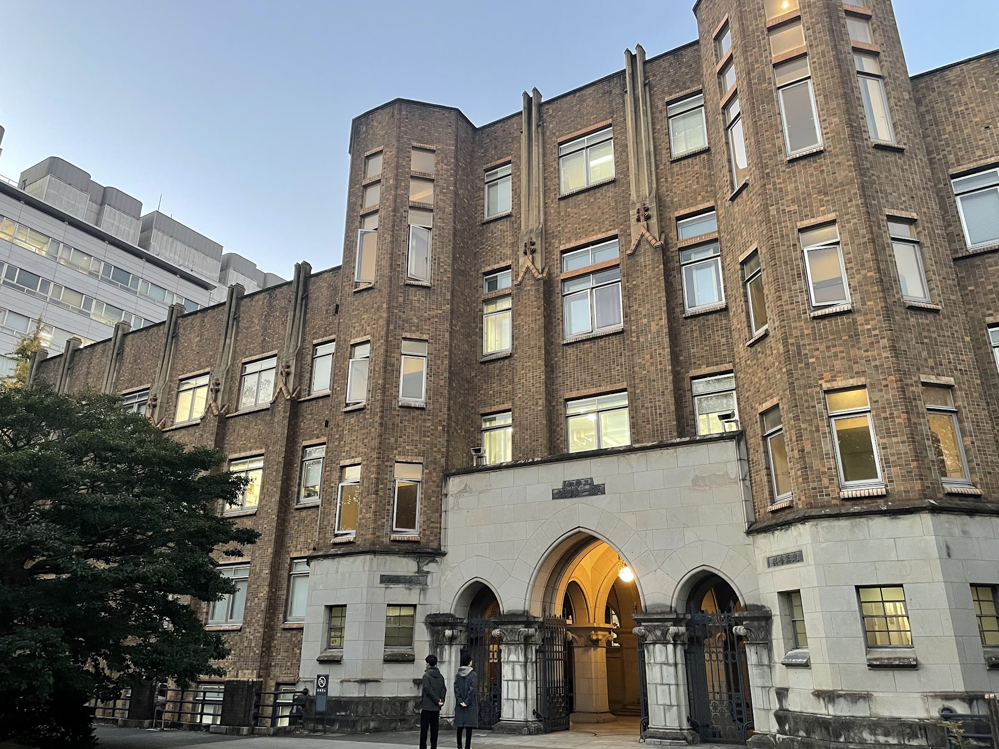

東京大学を訪れるのは初めてでしたが、想像していた規模とは桁違いに大学がデカい。

工学部の建物だけでも14号館があったり、古くからの歴史を感じる荘厳な佇まいの建物だったり、スタバがあったり……。
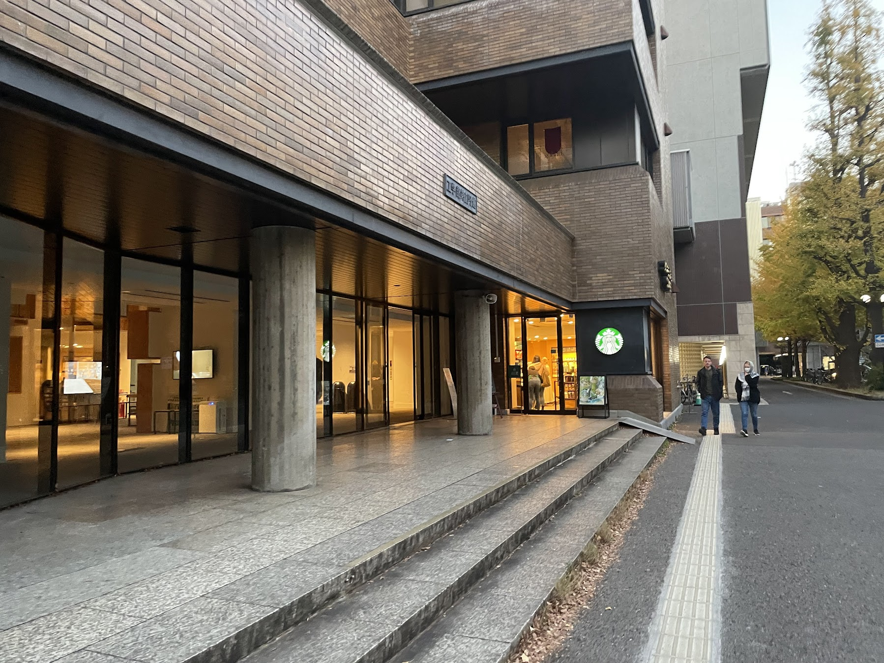
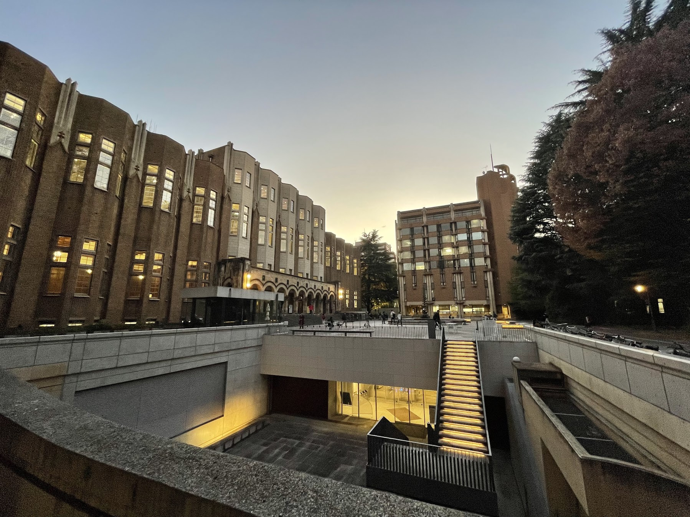

また、土曜日の朝にもかかわらず大学構内は大勢の人で賑わっており、イチョウ通りで写真を撮っている人もたくさんいました。
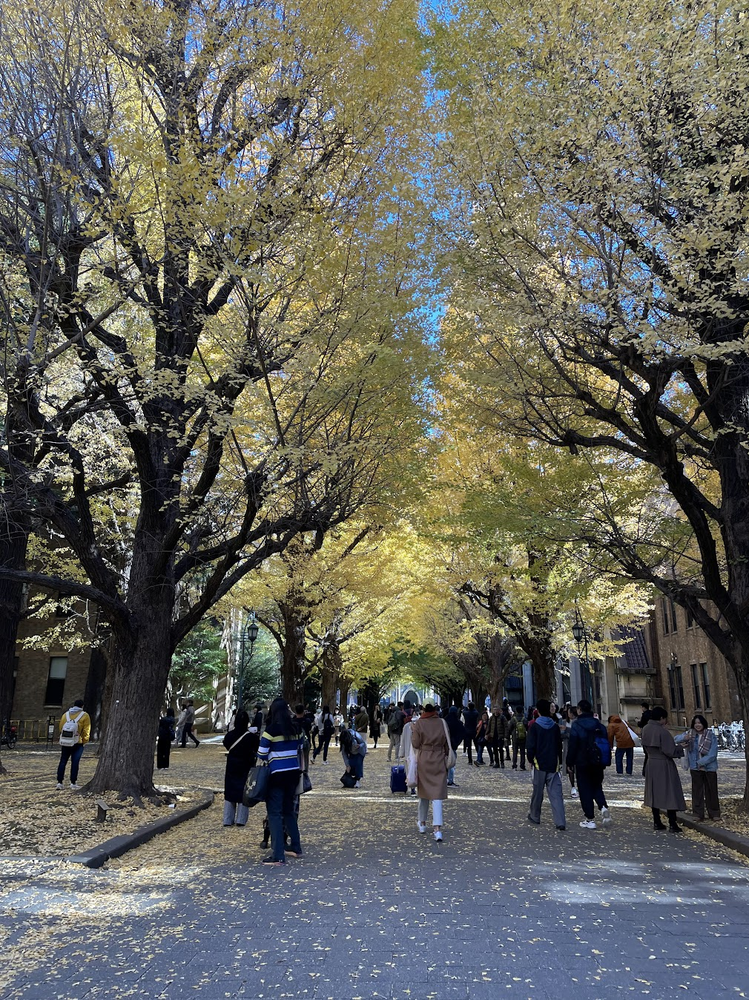

### メタバースラウンジ協賛会員体験会
展示会1日目は、[メタバースラウンジ](https://vr。u-tokyo。ac。jp/metaverse-lounge/home/)(東京大学VRセンターが今年6月から主宰し、協賛企業とメタバースの未来を議論する場) の協賛企業の方々に向けて作品を展示しました。

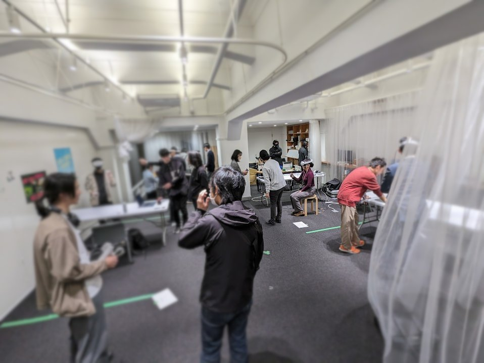

それぞれの団体が展示していた作品の紹介は後編の記事にて。

### お昼ごはん
東京大学の正門のすぐ向かいに「ル・ムーラン」という欧風カレーのお店に、会場で知り合ったU-lab (宇都宮大) のひとたちと食べに行ってきました。
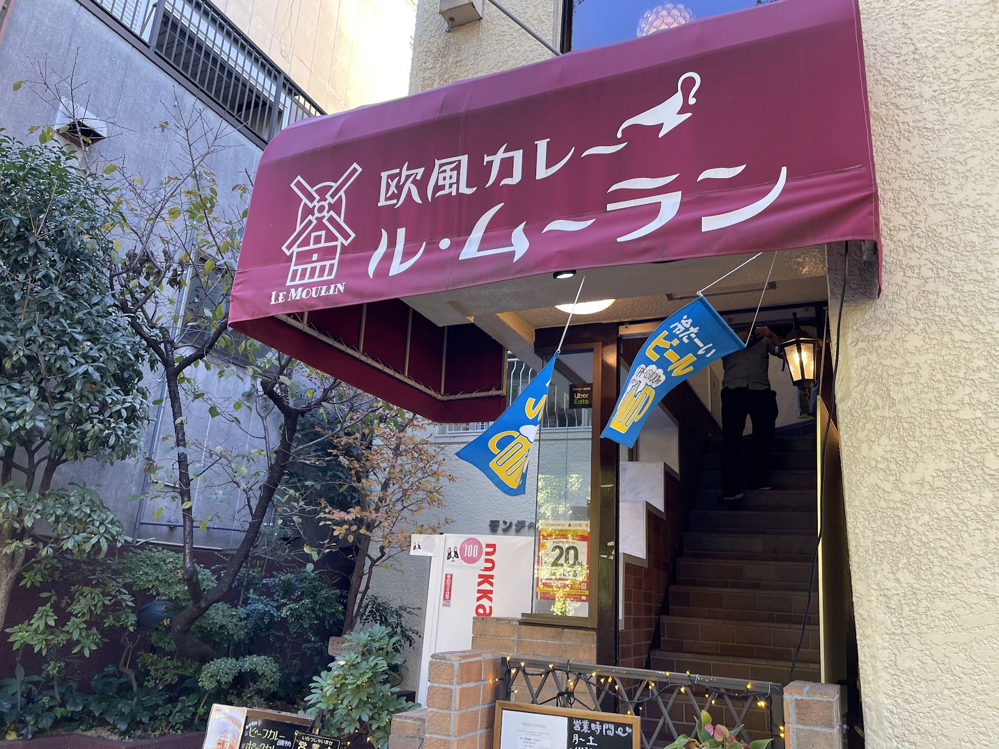

お値段こそなかなかものでしたが、店内からは正門の通りやイチョウ並木を眺められるおしゃれな雰囲気でした。

注文したビーフカレーは柔らかい牛肉がゴロゴロと入っていて美味しかったです。
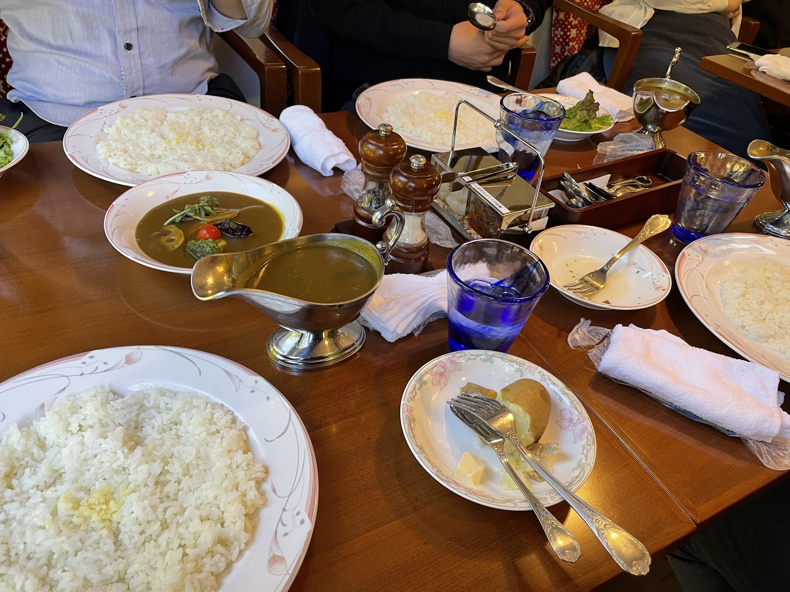

### 表彰式
この日の終わりに、懇談会と表彰式/企業賞授与式が行われました。

会場は東京大学本郷キャンパスの隣にある浅野キャンパスの建物で、中はバーのようにおしゃれなパーティ会場がありました。
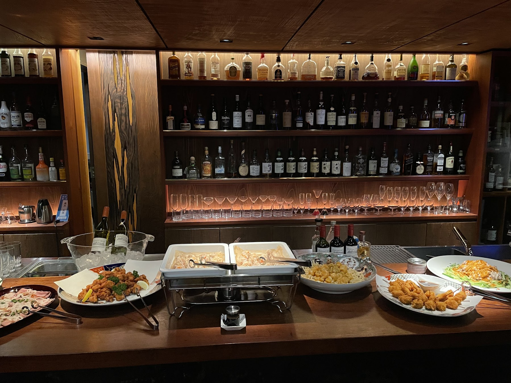

懇談会では豪華な料理に舌鼓を打ちながらお酒も楽しませていただきました。マグロの串かつ美味しかった。
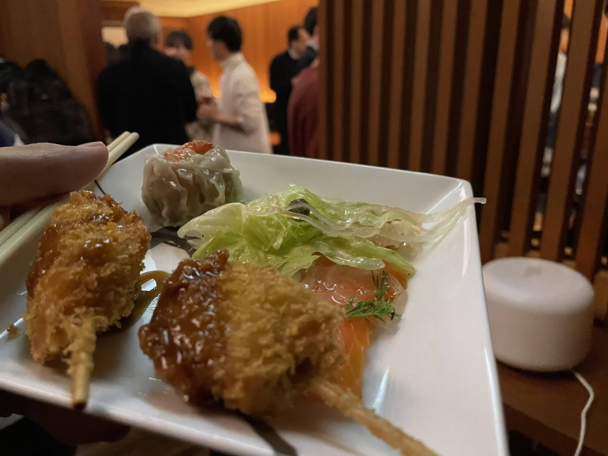

メタバースラウンジの協賛企業の方々 (NTTデータ、ニッスイ、集英社など有名企業ばかり!!) や、同じく今回のコンペに参加したサークルの皆さんと楽しくお話ができ、中には私たちの作品の今後に大いに参考になりそうな内容もありました。

懇談会の後半に表彰式が行われました。
まずは東大VRセンターから今回参加の5つのサークルに賞状が授与され、副賞としてMeta Quest 3も進呈してくれました。
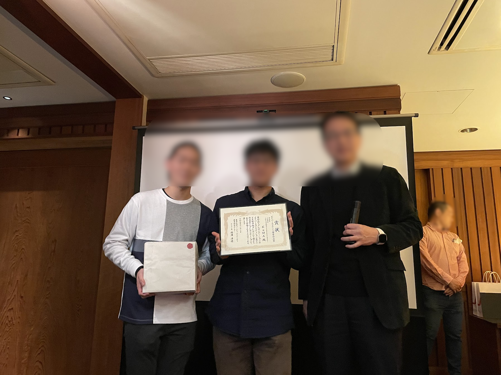

続いて、東大メタバースラウンジの協賛企業から、3つのサークルが選ばれ、企業賞が授与されました。

我々KuMAは株式会社ニッスイさんに選んでいただき、賞状に次いで、ニッスイさんの缶詰・瓶詰めをたくさんいただきました。
サークルのみんなで鍋でもしたいですね。
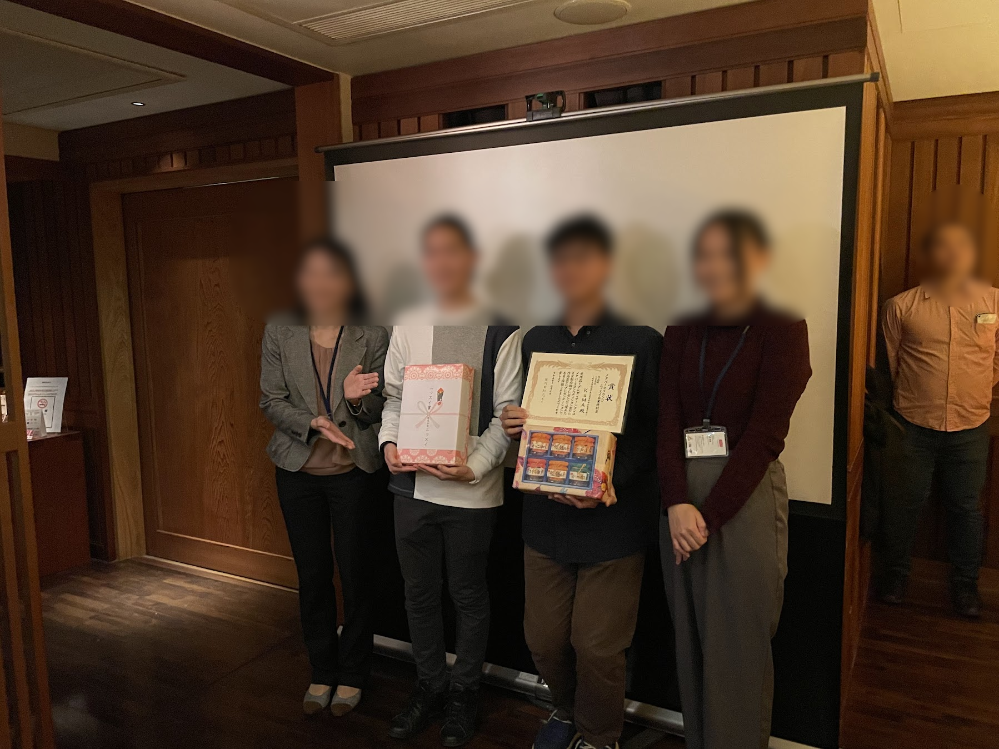